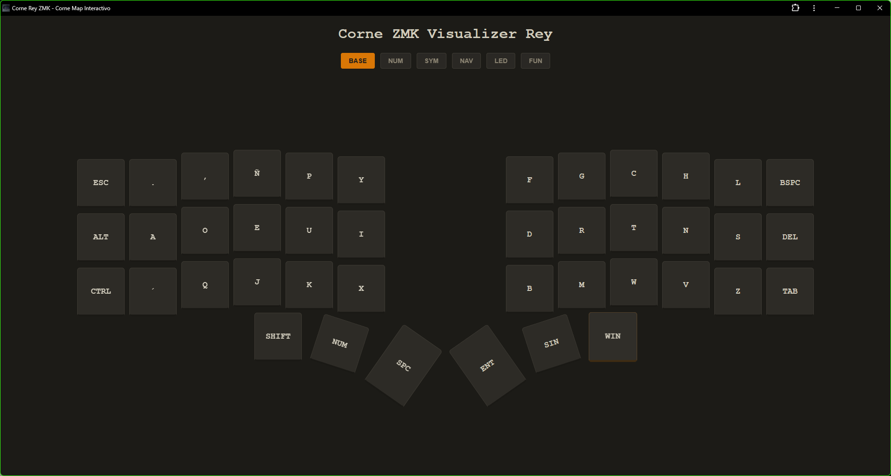
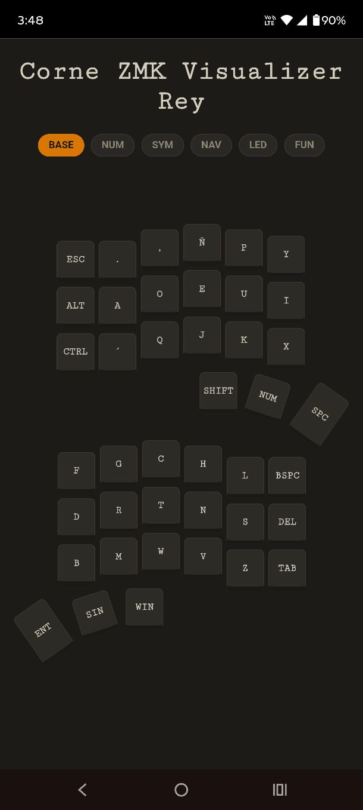
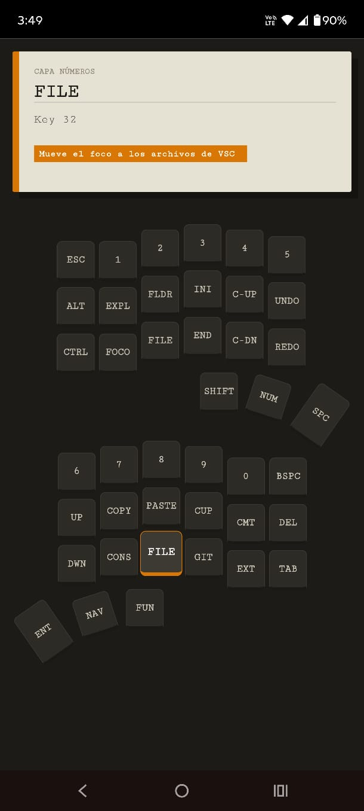

# Corne ZMK Visualizer Rey

Visualizador interactivo del **layout** que uso en mi **Corne (crkbd)** con firmware **ZMK**.






## Demo
 👉 https://hrking31.github.io/corne-keymap-visualizer-rey/
---

## 🚀 Descripción

Corne ZMK Visualizer Rey es un visualizador interactivo y minimalista de mi layout personalizado para teclado **Corne de 42 teclas**.

Muestra de forma clara y amigable las **6 capas principales** que uso diariamente, con descripciones detalladas por tecla y organización pensada para productividad extrema en desarrollo de software.

Funciona 100% offline como **PWA**, es responsive y permite explorar cada tecla con modal informativo al pasar el mouse o tocar en móvil.

---

## ✨ Características principales

- ✅ Visualización clara de las **6 capas**
- ✅ Interfaz limpia y responsive
- ✅ Modal descriptivo por tecla
- ✅ Soporte completo para **español** (Ñ, ¡¿, °, \|, etc.)
- ✅ Atajos altamente optimizados para **Visual Studio Code**
- ✅ Integración pensada para **Komorebi** (tiling window manager para Windows)
- ✅ Control completo de **RGB**
- ✅ Perfiles Bluetooth + controles multimedia
- ✅ Funciona sin conexión (PWA)

---

## 🧠 Capas disponibles

| Botón | Capa interna | Contenido principal | Uso típico |
|-------|-------------|--------------------|------------|
| Base | BASE | Dvorak adaptado + teclas de pulgar ergonómicas | Escritura diaria |
| Num | NUM | Números + atajos potentes de VSCode | Programación |
| Sym | SYM | Símbolos programación + escritura ES | Código y markdown |
| Nav | NAV | Navegación avanzada + Komorebi + VSCode | Productividad sin mouse |
| Led | LED | Control RGB completo | Personalización |
| Fun | FUN | F1–F12 + multimedia + BT1–BT5 | Funciones y perfiles |

---

## 🔎 Detalle de capas

### 🟢 BASE
- Dvorak adaptado
- Ñ cerca del índice
- Punto y coma en fila superior
- Teclas de pulgar optimizadas para fluidez

---

### 🔵 NUM
- Números en disposición cómoda
- Atajos avanzados de Visual Studio Code:
  - Mover líneas
  - Crear archivos/carpetas
  - Foco en Explorer
  - Git
  - Terminal
  - Undo / Redo
  - Toggle comment
  - Multi-cursor

---

### 🟣 SYM
- Símbolos de programación bien distribuidos
- Signos de escritura en español:
  - ¡ ¿ ° \| etc.
- Pensado para código frecuente y markdown

---

### 🟡 NAV
- Navegación avanzada
- Integración profunda con Komorebi
- Selecciones múltiples en VSCode
- Movimiento entre pestañas
- Productividad 100% keyboard-driven

---

### 🔴 LED
- Brillo
- Saturación
- Tono
- Velocidad
- Efecto
- Toggle on/off
- Power externo

---

### ⚪ FUN
- F1 – F12
- Multimedia
- BT1 – BT5
- Clear Bluetooth

---

## 🛠️ ¿Cómo usar el visualizador?

1. Clona el repositorio:

```bash
git clone https://github.com/hrking31/corne-zmk-visualizer-rey.git