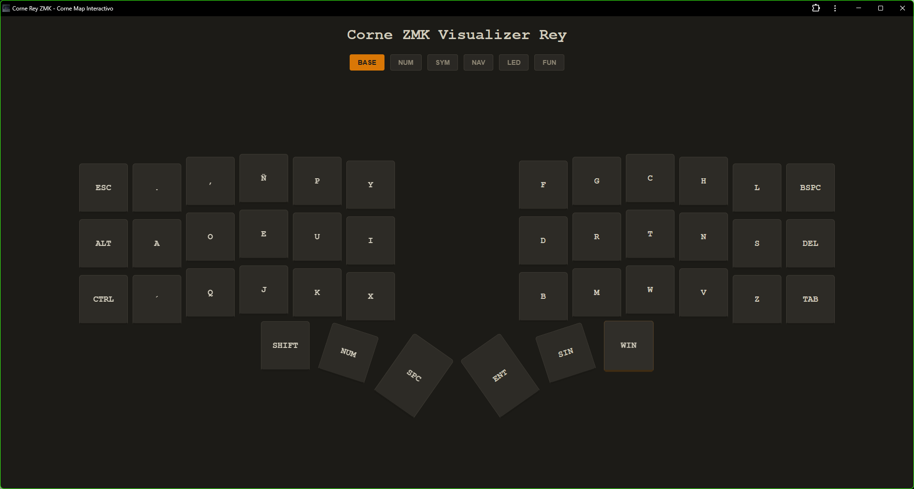
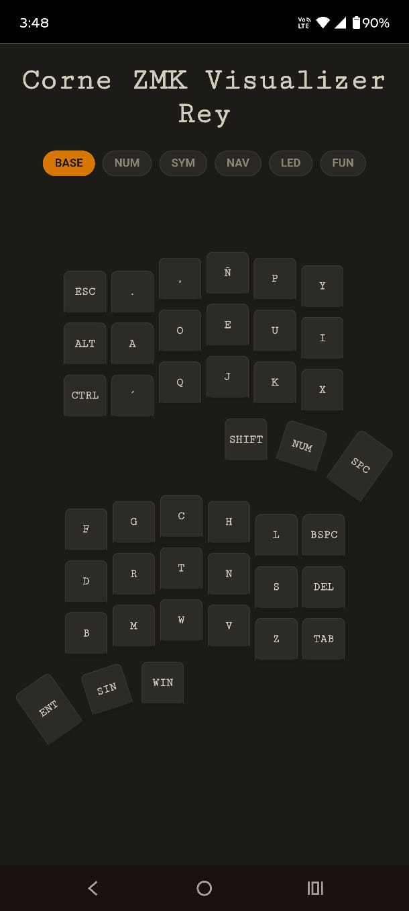
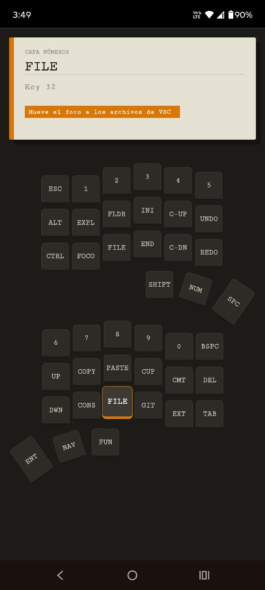

# Corne ZMK Visualizer Rey

Visualizador interactivo del **layout** que uso en mi **Corne (crkbd)** con firmware **ZMK**.





## 🔗 Demo

👉 **[hrking31.github.io/corne-keymap-visualizer-rey](https://hrking31.github.io/corne-keymap-visualizer-rey/)**

> ⌨️ El teclado, su configuración y las decisiones de diseño del layout están en el
> repositorio **[CorneRey-zmk](https://github.com/hrking31/CorneRey-zmk)**.

---

## 🚀 Por qué existe

Mi Corne tiene **42 teclas** y un teclado normal tiene 104. La diferencia no desaparece: se
esconde en **capas**. Igual que `Shift` convierte `a` en `A`, una tecla de capa convierte el
teclado entero en otro teclado. Seis capas, seis teclados.

Y ahí está el problema: **estoy aprendiendo un layout nuevo y no me lo sé todavía.**

Sabía que la llave `{` estaba en algún lugar de la capa de símbolos. Pero *«en algún lugar»*
no sirve cuando estás en medio de una función. La única fuente de verdad era mi archivo
`.keymap`: cientos de líneas de devicetree, perfecto para la máquina e inservible para
consultarlo a mitad de un pensamiento.

Necesitaba una **chuleta consultable**: ver el teclado dibujado, pasar el mouse sobre una
tecla y que me diga qué hace, sin salir de lo que estoy haciendo. Que funcione sin conexión y
que pueda abrirla en el celular mientras escribo en el PC.

Eso es esta app.

---

## ✨ Características

- ✅ Visualización de las **6 capas** completas, con la geometría real del Corne
- ✅ Modal descriptivo al pasar sobre cada tecla
- ✅ Interfaz limpia y responsive (escritorio, móvil vertical y horizontal)
- ✅ Funciona **sin conexión** (PWA instalable en el celular)
- ✅ Sin dependencias ni build: se sirve tal cual

---

## 🧠 Las capas que muestra

| Botón | Capa | Contenido |
|-------|------|-----------|
| **Base** | BASE | Letras y teclas de pulgar |
| **Num** | NUM | Números y atajos de VS Code |
| **Sym** | SYM | Símbolos de programación y escritura en español |
| **Nav** | NAV | Navegación y control de ventanas |
| **Led** | LED | Control del RGB |
| **Fun** | FUN | F1–F12, multimedia y perfiles Bluetooth |

> El detalle de qué hace cada tecla y por qué está donde está se documenta en el
> [repositorio del firmware](https://github.com/hrking31/CorneRey-zmk).

---

## 🛠️ Cómo usarlo

**La forma fácil:** abre la
[demo](https://hrking31.github.io/corne-keymap-visualizer-rey/). En el celular, usa «Añadir a
pantalla de inicio» y queda instalado como una app que funciona sin conexión.

**En local:**

```bash
git clone https://github.com/hrking31/corne-keymap-visualizer-rey.git
```

Luego abre `index.html` con cualquier servidor estático. Con la extensión *Live Server* de
VS Code basta.

> ⚠️ No lo abras con doble clic (`file://`): el service worker no se registra y algunos
> navegadores bloquean la carga de los scripts.

---

## 🔧 Cómo está hecho

```
index.html      # Una sola pantalla
app.js          # Render del teclado, modal y cambio de capa
data.js         # 6 capas × 42 teclas  ← el contenido
style.css       # Diseño y geometría del teclado
sw.js           # Service worker
manifest.json   # PWA
```

**Sin frameworks.** HTML, CSS y JavaScript puro. No porque los frameworks estén mal, sino
porque el problema no los pedía: es una pantalla que pinta 42 elementos y cambia de capa.
Meter React habría significado más build, más dependencias y más superficie de mantenimiento
para dibujar un teclado. Un buen desarrollador elige la herramienta según el problema; no al
revés.

**El teclado es CSS puro.** Esta fue la parte divertida. Un Corne no es una cuadrícula: las
columnas están escalonadas según el largo de cada dedo y las tres teclas de cada pulgar están
giradas en abanico. Está resuelto con **CSS Grid** más **variables por tecla** (`--tx`,
`--ty`, `--rot`, `--scale`, `--mirror`) combinadas en una sola `transform`. El escalonado usa
selectores `nth-child(6n + k)` y el abanico `nth-last-child`. Una mitad se dibuja y la otra se
espeja con `scaleX(-1)`, contra-espejando el texto de cada tecla para que siga siendo legible.
Cero imágenes, cero SVG: geometría declarativa.

**PWA sin internet.** Manifest y service worker con estrategia *network-first*: intenta traer
la versión fresca y, si no hay red, sirve la copia en caché. Una chuleta que necesita conexión
para consultarse no sirve de nada.

**Responsive de verdad.** En escritorio las dos mitades se muestran una al lado de otra, como
están sobre la mesa. En móvil vertical se apilan, y el panel de información aparece del lado
contrario a la mitad que estás tocando, para no tapar con el dedo lo que quieres leer. Hay un
breakpoint extra para móvil en horizontal, donde lo escaso no es el ancho sino el alto.

**Datos separados de la vista.** Todo el contenido vive en `data.js` como un objeto de seis
capas por 42 teclas. `app.js` no sabe nada de teclas concretas: solo recorre datos y pinta.
Añadir una capa no toca una línea de lógica.

---

## 🗺️ Próximos pasos

**Generar `data.js` desde el `.keymap`.** Hoy el firmware y el visualizador son dos fuentes de
verdad que hay que mantener a mano, y tarde o temprano se desincronizan. La evolución natural
es un generador que lea el `.keymap` de ZMK y produzca los datos del visualizador, corriendo
en GitHub Actions cada vez que cambie la configuración. El teclado y su chuleta dejarían de
poder contradecirse porque serían la misma fuente.

Después de eso:

- Buscador de teclas: *¿dónde está la llave?* → te dice la capa
- Navegación por teclado y etiquetas ARIA (un visualizador de teclado debería poder usarse con el teclado)
- Soporte táctil explícito, en lugar de depender de la emulación del navegador
- Exportar a PNG
- Modo de práctica que dicte combinaciones para memorizar la distribución

---

## 🧰 Stack

HTML5 · CSS3 (Grid, variables personalizadas, transforms) · JavaScript ES6 sin dependencias ·
PWA (Web App Manifest + Service Worker) · GitHub Pages

---

## 📚 Enlaces

- 🎹 [El teclado y su configuración (CorneRey-zmk)](https://github.com/hrking31/CorneRey-zmk)
- 📘 [ZMK Firmware](https://zmk.dev)
- ⌨️ [Corne (crkbd)](https://github.com/foostan/crkbd)

---

## 👤 Autor

Proyecto creado por **Hernando Rey**
🔗 [GitHub](https://github.com/hrking31)

⭐ Si te resulta útil, deja una estrella en el repo.
