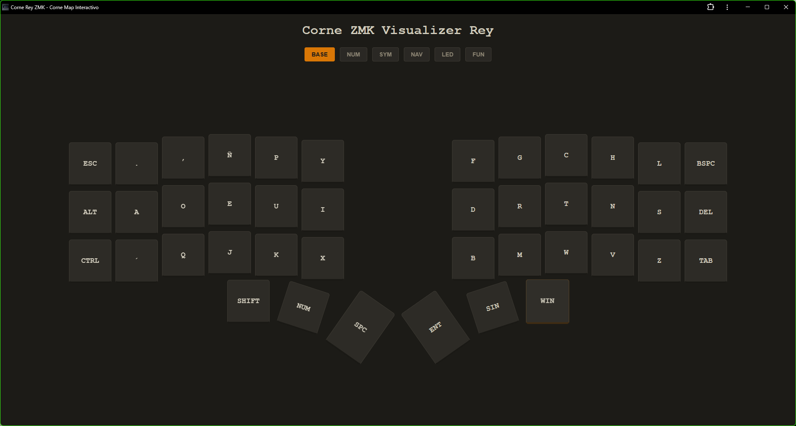
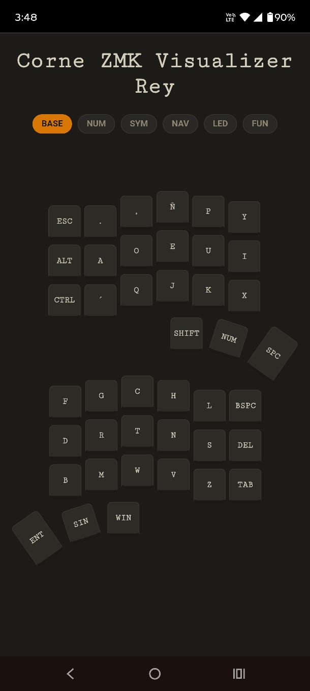
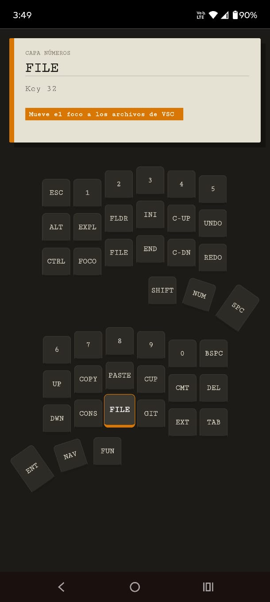

# Corne ZMK Visualizer Rey

Visualizador interactivo del **layout** que uso en mi **Corne (crkbd)** con firmware **ZMK**.





## 🔗 Demo

👉 **[corne-rey.web.app](https://corne-rey.web.app/)**

> ⌨️ El teclado, su configuración y las decisiones de diseño del layout están en el
> repositorio **[CorneRey-zmk](https://github.com/hrking31/CorneRey-zmk)**.

---

## 🚀 Por qué existe

Mi Corne tiene **42 teclas** y un teclado normal tiene 104. La diferencia no desaparece: se
esconde en **capas**. Igual que `Shift` convierte `a` en `A`, una tecla de capa convierte el
teclado entero en otro teclado. Seis capas, seis teclados.

Y ahí está el problema: **estoy aprendiendo un layout nuevo y no me lo sé todavía.**

Sabía que la llave `{` estaba en algún lugar de la capa de símbolos. Pero *«en algún lugar»*
no sirve cuando estás en medio de una función. La única fuente de verdad era mi archivo
`.keymap`: cientos de líneas de devicetree, perfecto para la máquina e inservible para
consultarlo a mitad de un pensamiento.

Necesitaba una **chuleta consultable**: ver el teclado dibujado, pasar el mouse sobre una
tecla y que me diga qué hace, sin salir de lo que estoy haciendo. Que funcione sin conexión y
que pueda abrirla en el celular mientras escribo en el PC.

Eso es esta app.

---

## ✨ Características

- ✅ Las **6 capas** completas, con la geometría real del Corne: columnas escalonadas y pulgares en abanico
- ✅ Panel con la descripción de cada tecla, con **ratón, teclado (Tab, Enter, Escape) o dedo**
- ✅ Accesible: cada tecla se anuncia en los lectores de pantalla («BSPC, Capa Base»)
- ✅ Responsive: escritorio, móvil vertical y horizontal
- ✅ **PWA** instalable que funciona **sin conexión**
- ✅ Cabeceras de seguridad estrictas (Content-Security-Policy y compañía)
- ✅ Una **prueba visual** que garantiza que el diseño no cambia sin querer

---

## 🧠 Las capas que muestra

| Botón | Capa | Contenido |
|-------|------|-----------|
| **Base** | BASE | Letras y teclas de pulgar |
| **Num** | NUM | Números y atajos de VS Code |
| **Sym** | SYM | Símbolos de programación y escritura en español |
| **Nav** | NAV | Navegación y control de ventanas |
| **Led** | LED | Control del RGB |
| **Fun** | FUN | F1–F12, multimedia y perfiles Bluetooth |

> El detalle de qué hace cada tecla y por qué está donde está se documenta en el
> [repositorio del firmware](https://github.com/hrking31/CorneRey-zmk).

---

## 🛠️ Cómo usarlo

**La forma fácil:** abre la [demo](https://corne-rey.web.app/). En el celular, usa «Añadir a
pantalla de inicio» y queda instalada como una app que funciona sin conexión.

**En local** (necesita Node.js 20.19 o superior):

```bash
git clone https://github.com/hrking31/corne-keymap-visualizer-rey.git
cd corne-keymap-visualizer-rey
npm install
npm run dev
```

| Comando | Qué hace |
|---|---|
| `npm run dev` | Servidor de desarrollo |
| `npm run build` | Comprueba los tipos y compila en `dist/` |
| `npm run preview` | Sirve lo compilado **con las mismas cabeceras de seguridad que producción** |
| `npm run lint` | Revisa el código con ESLint (sin avisos permitidos) |
| `npm test` | Todas las pruebas: datos, lógica y diseño |
| `npm run test:unit` | Solo las rápidas (datos y lógica) |
| `npm run test:visual` | Solo la prueba visual (abre Chromium sin ventana) |

---

## 🔧 Cómo está hecho

```
src/
  App.tsx              # Estado (capa, panel), botones de capa, posición del panel
  components/
    Bloque.tsx         # Una mitad del teclado
    Modal.tsx          # El panel con la descripción de cada tecla
  data.ts              # 6 capas × 42 teclas  ← el contenido
  teclado.ts           # Lógica pura: bloques y filas
  tipos.ts             # Capa, Tecla, Keymap
  style.css            # Todo el diseño, incluida la geometría del teclado
tests/
  *.test.ts            # Datos y lógica (Vitest)
  visual/              # Prueba visual (Vitest en modo navegador)
  referencia/          # Copia congelada de la versión original
firebase.json          # Hosting y cabeceras de seguridad
.github/workflows/     # Revisión y publicación automáticas
```

### Primero sin frameworks, después React

La primera versión era HTML, CSS y JavaScript puro, y estaba bien así: una pantalla que pinta
42 elementos y cambia de capa no pedía más. Sigue disponible en la etiqueta
[`v1.1-vanilla`](https://github.com/hrking31/corne-keymap-visualizer-rey/tree/v1.1-vanilla).

La migré a **React + TypeScript + Vite** cuando el plan creció: un editor con inicio de
sesión, una base de datos y, más adelante, que cualquiera pueda cargar su propio teclado.
La regla de la migración fue que **no cambiara un solo píxel**, y no se comprobó a ojo:
una prueba mide las dos versiones en el mismo navegador, en cuatro tamaños de pantalla, y
compara la posición de las 252 teclas, su fuente, los 213 paneles y la paleta de colores.
Esa prueba atrapó cambios que nadie habría visto, como un elemento vacío que aportaba 11 px
de aire al panel, o una animación que aparecía porque React reutiliza los elementos.

### El teclado es CSS puro

Un Corne no es una cuadrícula: las columnas están escalonadas según el largo de cada dedo y
las tres teclas de cada pulgar están giradas en abanico. Está resuelto con **CSS Grid** más
**variables por tecla** (`--tx`, `--ty`, `--rot`, `--scale`, `--mirror`) combinadas en una
sola `transform`. El escalonado usa selectores `nth-child(6n + k)` y el abanico
`nth-last-child`. Cero imágenes, cero SVG: geometría declarativa.

### ⭐ El truco del espejo: una sola regla para las dos manos

Las dos mitades de un Corne son simétricas: la columna del dedo medio es la más alta en las
dos, y los pulgares se abren en abanico hacia el centro. Escribir el escalonado dos veces,
una por mano y con los valores al revés, era lo obvio. En lugar de eso, **la mitad izquierda
se dibuja como una copia de la derecha y luego se refleja**, como en un espejo:

```
Lo que ves:   ESC  .   ,   Ñ   P   Y            F   G   C   H   L  BSPC
                       ▲   ▲▲  ▲                    ▲   ▲▲  ▲
                       dedo medio (más alta)        dedo medio (más alta)

1. data.ts guarda la mitad izquierda:   ESC  .   ,   Ñ   P   Y
2. El código invierte cada fila:        Y    P   Ñ   ,   .   ESC
   → ahora está en el mismo orden que la derecha: F G C H L BSPC
3. El CSS sube cada tecla según su posición, contando desde dentro:
      1.ª 6 px · 2.ª 14 px · 3.ª 20 px · 4.ª 14 px · 5.ª y 6.ª 0 px
   → la misma regla sirve para las dos mitades
4. scaleX(-1) refleja la mitad entera:  ESC  .   ,   Ñ   P   Y   ✓
5. --mirror: -1 vuelve a voltear cada tecla, para que la «Ñ» no se lea al revés
```

Resultado: **cuatro reglas de escalonado y tres de pulgares dibujan las 42 teclas**. Cambiar
la altura de una columna se hace en un solo sitio y las dos manos quedan siempre simétricas.

El precio, aceptado a conciencia: el navegador recorre las teclas en el orden del paso 2,
así que con la tecla Tab la mitad izquierda se recorre de dentro hacia fuera (Y, P, Ñ… ESC).
Todas las teclas siguen siendo alcanzables; a cambio, la geometría no se duplica.

### Responsive de verdad

En escritorio las dos mitades se muestran una al lado de otra, como están sobre la mesa, y el
panel de información aparece **quieto sobre la mitad contraria** a la tecla, a media altura de
la pantalla: nunca tapa la tecla que tocas ni persigue al ratón o al dedo. En móvil vertical
las mitades se apilan, cada una desplazada 0,6 teclas hacia fuera para que los pulgares en
abanico no se corten, y el panel aparece arriba o abajo, del lado contrario a la mitad que
estás tocando.

### Calidad y seguridad

- **Revisión automática** en cada cambio (GitHub Actions): vulnerabilidades en las
  dependencias, ESLint, TypeScript, las pruebas y la compilación. Si algo falla, no se publica.
  Cada *pull request* recibe su propia vista previa en Firebase.
- **Cabeceras de seguridad** en Firebase Hosting: CSP que solo permite recursos propios,
  protección contra *clickjacking* (`frame-ancestors 'none'`), `nosniff`, `Referrer-Policy` y
  `Permissions-Policy`.
- **Credenciales con permisos mínimos:** la cuenta que publica desde GitHub solo puede tocar
  Hosting.
- **Sin conexión:** `vite-plugin-pwa` genera el service worker y el manifiesto, con un ícono
  adaptable (*maskable*) para Android.

---

## 🗺️ Próximos pasos

- **Editor con inicio de sesión** (Firebase Authentication + Firestore): escribir desde el
  celular qué hace cada tecla, sin tocar el código. Lectura pública, escritura solo del dueño.
- **Generar los datos desde el `.keymap`**: que el firmware y el visualizador no puedan
  contradecirse porque salen de la misma fuente.
- **Cualquier teclado ZMK**: que cualquiera cargue su `.keymap` y obtenga su propio visualizador.
- **Google Play**, como Trusted Web Activity.
- Buscador inverso (*¿cómo escribo `{`?*), modo práctica y exportar a imagen.

---

## 🧰 Stack

React 19 · TypeScript · Vite · CSS3 (Grid, variables, transforms) · Vitest (también en modo
navegador) · ESLint · vite-plugin-pwa · Firebase Hosting · GitHub Actions

---

## 📚 Enlaces

- 🎹 [El teclado y su configuración (CorneRey-zmk)](https://github.com/hrking31/CorneRey-zmk)
- 📘 [ZMK Firmware](https://zmk.dev)
- ⌨️ [Corne (crkbd)](https://github.com/foostan/crkbd)

⭐ Si te resulta útil, deja una estrella en el repo.

---

<p align="center">
  <a href="https://hernandorey-31.web.app/">
    <picture>
      <source media="(prefers-color-scheme: dark)" srcset="https://raw.githubusercontent.com/hrking31/hrking31/main/firma/firma-es-oscuro.svg">
      
    </picture>
  </a>
</p>

<p align="center">
  <a href="https://hernandorey-31.web.app/"><picture><source media="(prefers-color-scheme: dark)" srcset="https://raw.githubusercontent.com/hrking31/hrking31/main/firma/boton-portafolio-oscuro.svg"></picture></a>
  <a href="https://www.linkedin.com/in/hernandorey/"><picture><source media="(prefers-color-scheme: dark)" srcset="https://raw.githubusercontent.com/hrking31/hrking31/main/firma/boton-linkedin-oscuro.svg"></picture></a>
  <a href="https://github.com/hrking31"><picture><source media="(prefers-color-scheme: dark)" srcset="https://raw.githubusercontent.com/hrking31/hrking31/main/firma/boton-github-oscuro.svg"></picture></a>
  <a href="https://mail.google.com/mail/?view=cm&amp;fs=1&amp;to=hrking31@gmail.com"><picture><source media="(prefers-color-scheme: dark)" srcset="https://raw.githubusercontent.com/hrking31/hrking31/main/firma/boton-correo-oscuro.svg"></picture></a>
</p>
